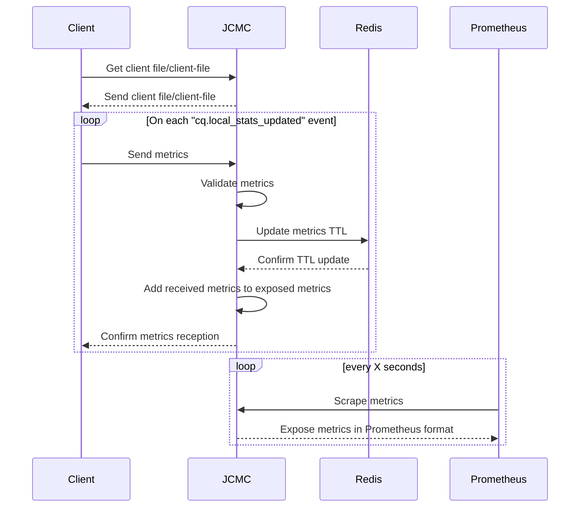

# Jitsi Client Metrics Collector (JCMC)

> [!WARNING]  
> Project is still under development


## Description

This project is a Node.js application built using the Express.js framework. It provides a RESTful API for managing Jitsi clients metrics (browser). The application is designed to be scalable, maintainable, and easy to extend with additional features.


## Features

- RESTful API endpoints
- Data validation
- Error handling
- Environment-based configuration
- Logging

## Requirements

- Node.js (version v22.5.1 or higher). This project hasn't been tested with other versions of Node.js
- Redis

## Installation

1. Clone the repository:
    ```sh
    git clone https://github.com/HamzaKhait/jitsi-client-metrics-collector.git
    cd jitsi-client-metrics-collector
    ```
2. Install dependencies:
    ```sh
    npm install
    ```

3. Adjust the variables in `.env` file according to your needs
4. Install redis server https://redis.io/docs/latest/operate/oss_and_stack/install/install-redis

## Environment Variables

The following environment variables are required:

```
NODE_ENV=development
REDIS_URL=redis://127.0.0.1:6379
METRICS_EXPIRATION_CHECK=5 # In seconds
METRICS_EXPIRATION=30 #In seconds
ALLOW_PRIVATE_SCRAPE_ONLY=true
PUSH_URL=http://127.0.0.1:3000/metrics/push # the push url that will be used by users
```

## Running the Application

### Development

To run the application in development mode:

```sh
npm start
```

### Production
1. Download and uncompress the [latest release](https://github.com/HamzaKhait/jitsi-client-metrics-collector/releases/latest)
1. Install dependencies (don't forget Redis):
    ```sh
    npm install
    ```

To run the application in production mode:

```sh
npm start
```

## Contribution

1. Fork the repository.
2. Create a new branch (`git checkout -b feature-branch`).
3. Make your changes.
4. Commit your changes (`git commit -am 'Add new feature'`).
5. Push to the branch (`git push origin feature-branch`).
6. Open a pull request.

## Author

[Hamza KHAIT](https://github.com/HamzaKhait)

For any queries or issues, please open an issue on GitHub.
